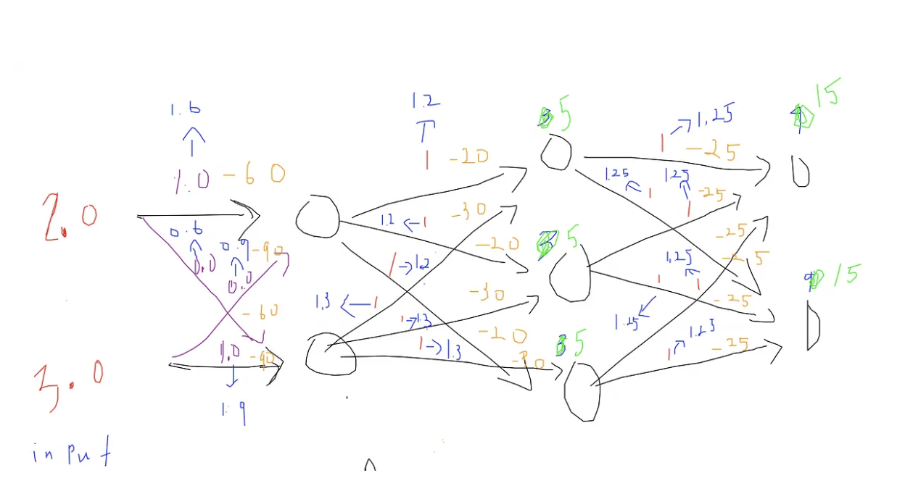

$$
\text{Accuracy}
=
\frac{\text{Number of correct predictions}}
{\text{Total number of predictions}}
$$

$$
\text{Precision}
=
\frac{\text{True Positive}}
{\text{True Positive + False Positive}}
$$

$$
\text{Recall}
= 
\frac{\text{True Positive}}
{\text{True Positive + False Negative}}
$$

$$
\text{Mean}
= 
\frac{\text{sum of all numbers}}
{\text{count of all numbers}}
$$

$$
\text{Variance}
=
\frac{(x_1-\mu)^2 + (x_2-\mu)^2 + \cdots + (x_n-\mu)^2}{n}
$$

$$
\sigma(x)
=
\frac{1}{1 + e^{-x}}
$$

$$
\text{Softmax}(z_i)
=
\frac{e^{z_i}}
{\sum_{j=1}^{K} e^{z_j}}
$$

$$
\text{Population}
=
\text{the entire set of data}
$$

$$
\text{Sample}
=
\text{a subset of the population}
$$

$$
\begin{aligned}
&\text{Batch size, learning rate, and the number of epochs are hyperparameters.} \\
&\text{The batch size I am using in my current project is 16,} \\
&\text{and the learning rate is } 3 \times 10^{-5}. \\
&\text{The number of epochs was previously 10.}
\end{aligned}
$$

$$
\begin{aligned}
&\text{A GPU cluster consists of multiple nodes, each of which can contain multiple GPUs.} \\
&\text{In my current project, I am using a single NVIDIA A100-SXM4-80GB GPU.}
\end{aligned}
$$

 
 

What is back-propagation?
Let's first look at the fully-connected neural network.

The fully-connected neural network has initial weights. When the two inputs are fed into the network, 
15 and 15 are outputted (if softmax layer is used, the outputs will be turned into a vector of probabilities [0.5,0.5]). The mean-squared loss of 25 is calculated and then backpropagation occurs (gradients of weights are computed). 
Then, gradient descent can be applied to all the weights of the fully-connected neural network. What is gradient descent trying to achieve?

What is scaling law?

