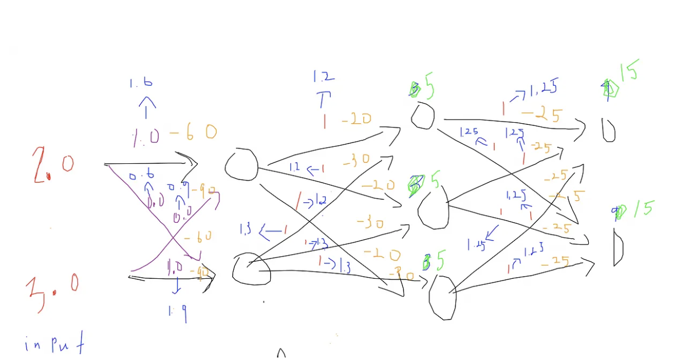
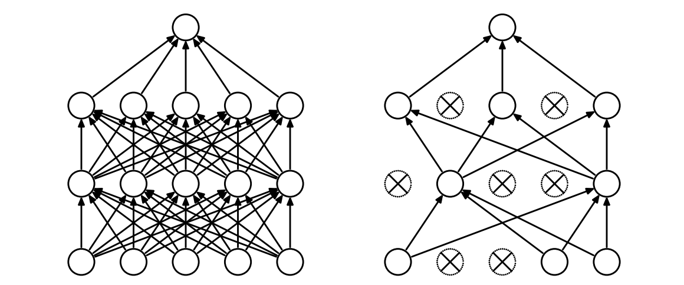

$$
\text{Accuracy}
=
\frac{\text{Number of correct predictions}}
{\text{Total number of predictions}}
$$

$$
\text{Precision}
=
\frac{\text{True Positive}}
{\text{True Positive + False Positive}}
$$

$$
\text{Recall}
= 
\frac{\text{True Positive}}
{\text{True Positive + False Negative}}
$$

$$
\text{Mean}
= 
\frac{\text{sum of all numbers}}
{\text{count of all numbers}}
$$

$$
\text{Variance}
=
\frac{(x_1-\mu)^2 + (x_2-\mu)^2 + \cdots + (x_n-\mu)^2}{n}
$$

$$
\sigma(x)
=
\frac{1}{1 + e^{-x}}
$$

$$
\text{Softmax}(z_i)
=
\frac{e^{z_i}}
{\sum_{j=1}^{K} e^{z_j}}
$$

$$
\text{Population}
=
\text{the entire set of data}
$$

$$
\text{Sample}
=
\text{a subset of the population}
$$

 
 

What is back-propagation?
Let's first look at the fully-connected neural network.

The fully-connected neural network has initial weights. When the two inputs are fed into the network, 
15 and 15 are outputted (if softmax layer is used, the outputs will be turned into a vector of probabilities [0.5,0.5]). The mean-squared loss of 25 is calculated and then backpropagation occurs (gradients of weights are computed). 
Then, gradient descent can be applied to all the weights of the fully-connected neural network. What is gradient descent trying to achieve?

What is **dropout?**

The following diagram is taken from "Dropout: A Simple Way to Prevent Neural Networks from Overfitting".
What see on the left is a fully-connected neural network. The fully-connected neural network has 2 hidden-layers
which consist of 10 nodes. What we see on the right side is the result of dropout on the fully-connected neural network on the left side.

What is **CrossEntropyLoss?**

CrossEntropyLoss is defined as the following.

$$
\begin{aligned}
\text{CrossEntropyLoss} &= -\sum_{c=1}^{C} y_c \log(p_c) \\
\text{where}\quad C &= \text{number of classes} \\
y_c &= \text{one-hot label for class } c \\
p_c &= \text{probability of class } c
\end{aligned}
$$

Now we have defined CrossEntropyLoss, let's calculate CrossEntropy for different cases.

Example 1:
y_c = [0 0 1],
p_c = [0.01 0.01 0.98]

For example 1,

$$
\text{CrossEntropyLoss}
= -\left(0\ln(0.01) + 0\ln(0.01) + 1\ln(0.98)\right)
= -\ln(0.98)
\approx 0.02
$$

Example 2:
y_c = [0 0 1],
p_c = [0.98 0.01 0.01]

For example 2,

$$
\text{CrossEntropyLoss}
= -\left(0\ln(0.98) + 0\ln(0.01) + 1\ln(0.01)\right)
= -\ln(0.01)
\approx 4.60
$$

When a high probability is assigned to the wrong class, the CrossEntropyLoss is higher.

Example 3:
y_c = [0 0 1],
p_c = [0.33 0.35 0.32]

For example 3,

$$
\text{CrossEntropyLoss}
= -\left(0\ln(0.33) + 0\ln(0.35) + 1\ln(0.32)\right)
\approx 2.18
$$

When a lower probability is assigned to the wrong class compared to example 2,
the CrossEntropyLoss is lower. 

